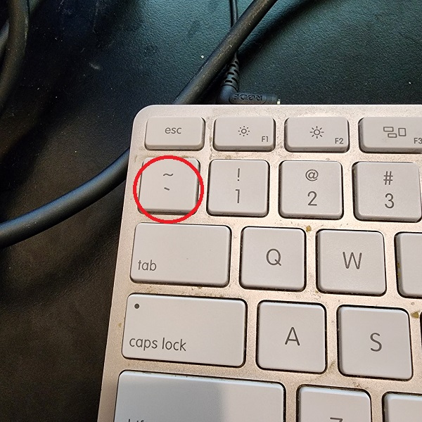

# Writing Good Documentation

## Step 1  - Using Codeblocks.

Codeblocks in markdown make it *very easy* for tech people to **copy, paste, share** code.
A good __Cloud Engineer__ uses Codeblocks whenever possible.

Because it allows others to copy and paste their code to replicate or research issues.

- In order to create codeblocks in markdown you need to use three backticks ( ` ) 
- Not to be confused with quotaion ( ' )

## Step 2 - codeblocks
- When you can you should attempt to apply syntax highlighting to your codeblocks
```java
public class FactorialCalculator {

    public static void main(String[] args) {
        int number = 5; // Change this number to calculate the factorial of a different value
        long factorial = calculateFactorial(number);
        System.out.println("The factorial of " + number + " is: " + factorial);
    }

    public static long calculateFactorial(int n) {
        if (n == 0 || n == 1) {
            return 1;
        } else {
            return n * calculateFactorial(n - 1);
        }
    }
}
```
- Make note of where the backtick button is located.
- It should appear above the tab key, but it may vary based on your keyboard layout.

Good Cloud Engineers use codeblocks for both code and errors that appear in the console. 

> Here is an exmaple that appears in bash

```bash
Exception in thread "main" java.lang.NullPointerException
    at NullPointerExceptionExample.main(NullPointerExceptionExample.java:4)
```
## Step 3 - Use Github Flavoured Task Lists
Github extends Markdown to have a list where you can check the items [<sup>[1]</sup>](#external-refernces)

- [x] Finish Step 1
- [] Finish Step 2
- [] Finish Step 3

## Step 4 Use Emoji's - Optional
GFM supports emoji

| Name | Shortcode | Emoji |
|------| --------- |-------|
| abc | `:cloud:`      | :cloud:|
| abc | `:cloud with lighting:`   | 🌩️|


## Step 5 - how to create a table 

You can use the following format to create tables

Github extends the functionality of Markdown tables to provide more alignment and table cell formatting options.<sup>[2]</sup>


```md
| Name | Shortcode | Emoji |
|------| --------- |-------|
| abc | `:cloud:`      | :cloud:|
| abc | `:cloud with lighting:`   | 🌩️|
```


## External Refernces

- [Basic writing and formatting syntax](https://docs.github.com/en/get-started/writing-on-github/getting-started-with-writing-and-formatting-on-github/basic-writing-and-formatting-syntax) 
- [GitHub Flavored Markdown Spec](https://github.github.com/gfm/)
- [GFM - Task List](https://docs.github.com/en/get-started/writing-on-github/getting-started-with-writing-and-formatting-on-github/basic-writing-and-formatting-syntax#task-lists) <sup>[1]</sup>
- [GTM - Emoji Cheat Sheet](https://github.com/ikatyang/emoji-cheat-sheet)
- [GFM - Tables (with extensions)](https://github.github.com/gfm/#tables-extension-)<sup>[2]</sup>

  


